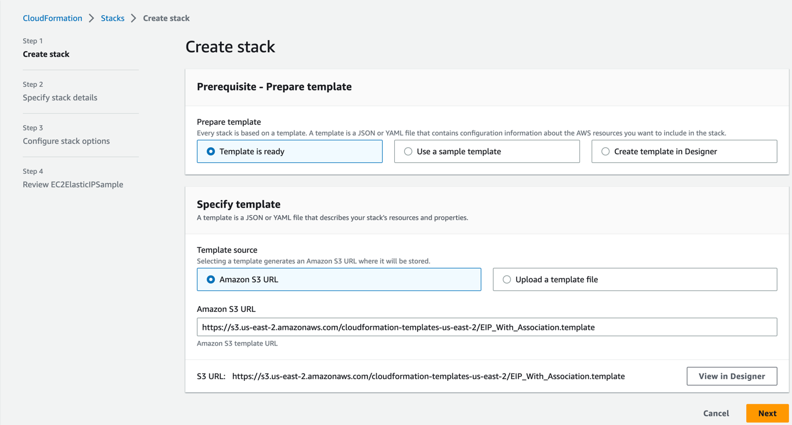
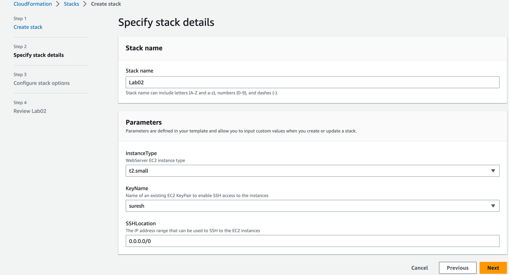
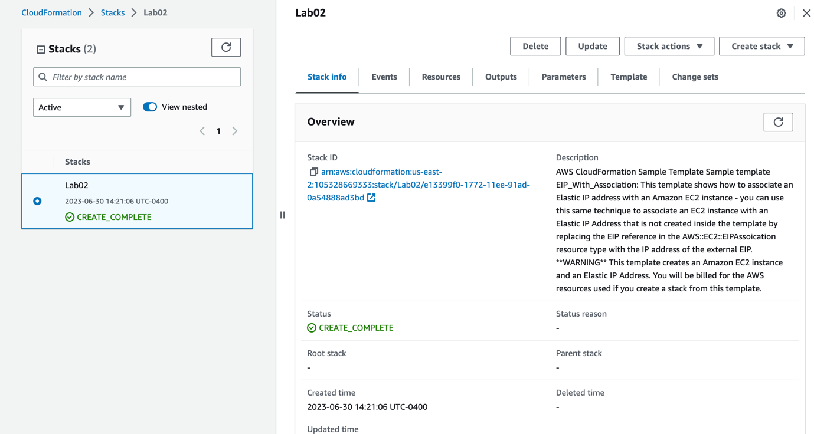
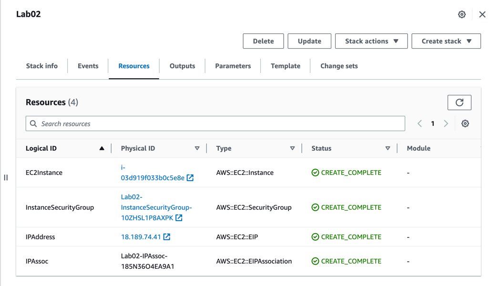
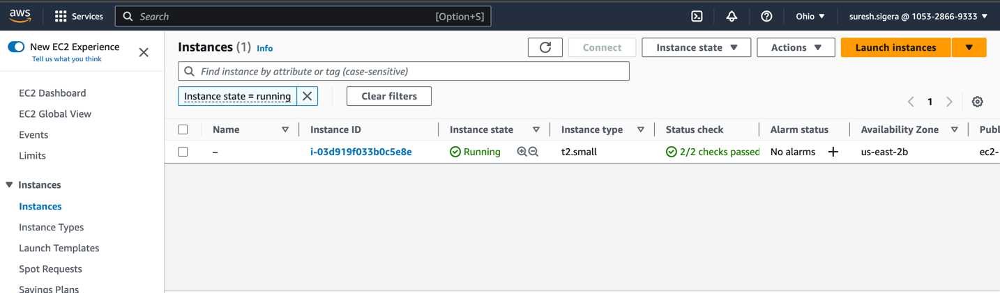
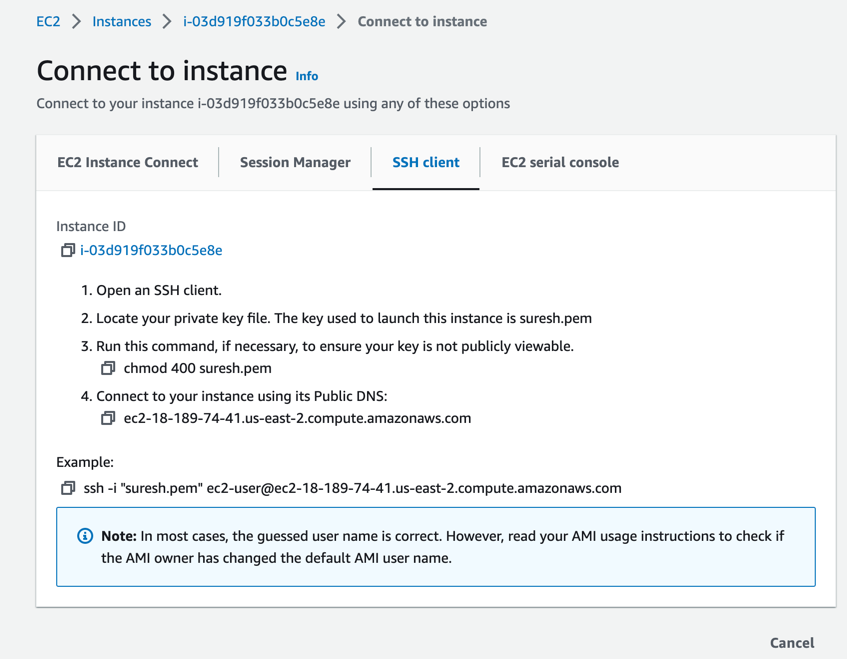
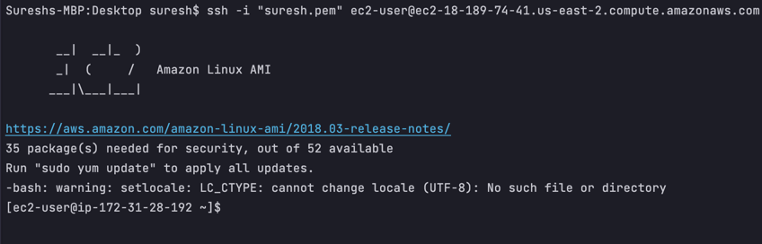

#  AWS CloudFormation Provisioning Resources

| Title                                     | Type | Duration | 
|-------------------------------------------|------|----------|
| AWS CloudFormation Provisioning Resources | Lab  | 1:00     |

- [ AWS CloudFormation Provisioning Resources](#-aws-cloudformation-provisioning-resources)
  - [Objectives](#objectives)
  - [Instructions](#instructions)
  - [Troubleshooting](#troubleshooting)

## Objectives

*After this lesson, students will be able to:*

- Understand the concept of infrastructure-as-code and the role of AWS CloudFormation in provisioning and managing AWS
  resources.
- Gain familiarity with the AWS CloudFormation Designer and its visual representation of resources.
- Learn how to create a CloudFormation stack and configure the stack details.
- Understand the importance of key pairs for SSH access to EC2 instances and learn how to select an existing key pair or
  create a new one.
- Gain hands-on experience in launching an EC2 instance with a public IP using CloudFormation.
- Understand the process of reviewing and validating stack information before initiating the stack creation.
- Learn how to submit the CloudFormation stack creation and monitor the deployment process.
- Gain proficiency in SSHing into the deployed EC2 instance using the assigned public IP address.

In this lab, you will gain hands-on experience using AWS CloudFormation to deploy a single virtual machine (EC2
instance) with a public IP address. Following the steps below, you will be able to provision infrastructure-as-code and
launch an EC2 instance using CloudFormation.

## Instructions

- Visit the AWS CloudFormation guide to
  see [sample templates](https://aws.amazon.com/cloudformation/templates/aws-cloudformation-templates-sa-east-1/)
  for AWS CloudFormation.
- Look for the EIP_With_Association.template (Associate an EC2 Instance with a pre-existing EIP.)  
- You can begin the stack creation by returning to the previous browser tab and clicking on **Launch Stack** button.
- In Step 1 of the stack creation wizard, leave all the fields at their default values and click **Next**.
  
- Provide a suitable name for the stack, such as **Lab02**, or any other preferred name. Select the appropriate Key
  Pair from the list. Note: If no key pairs are available, you will need to either create a
  new key pair manually or modify the template to include the creation of a key pair.
  
- Click **Next** to proceed to Step 3.
- In Step 3, leave all the options at their default values and click **Next**.
- Review the stack information on the **Review** page to ensure all the details are correct.
- Click **Submit** to initiate the CloudFormation stack creation.
- Monitor the stack creation process until it is completed.
  
- Once the stack creation is successful, retrieve the assigned public IP address of the EC2 instance.
  
  
- Use an SSH client to connect to the EC2 instance using the public IP address, following the appropriate SSH command
  syntax for your operating system.
  



Congratulations! You have successfully deployed an EC2 instance with a public IP address using AWS CloudFormation.

## Troubleshooting

How to fix the unprotected private key file error?

The **unprotected private key file** error typically occurs when the permissions on your private key file are too
permissive, making it accessible to other users or processes on your system. To fix this error, you need to restrict the
permissions on your private key file. Here's how you can do it:

1. Locate your private key file. It is usually a file with a `.pem` extension.
2. Open a terminal or command prompt.
3. Change the permissions of the private key file to make it readable only by the owner. Run the following command:

  ```text
  chmod 400 /path/to/private_key.pem
  ```

4. Replace `/path/to/private_key.pem` with the actual path to your private key file.
5. Verify the permissions by running the following command:

```text
ls -l /path/to/private_key.pem
```

Make sure the permissions are set to `-r-------- or -rw-------`, indicating that only the owner has read access.

6. Try using the private key file again to connect to your server or perform the desired operation. The **unprotected
   private key file** error should no longer occur.

By restricting the permissions on your private key file, you ensure that it is only accessible to you, enhancing the
security of your SSH connections.


