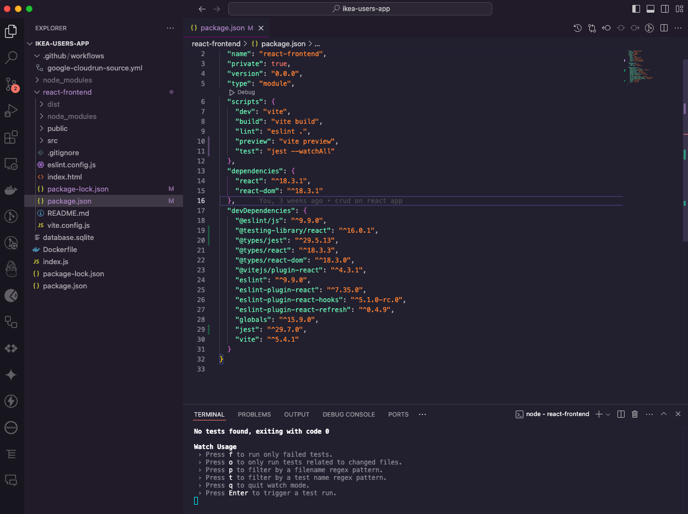
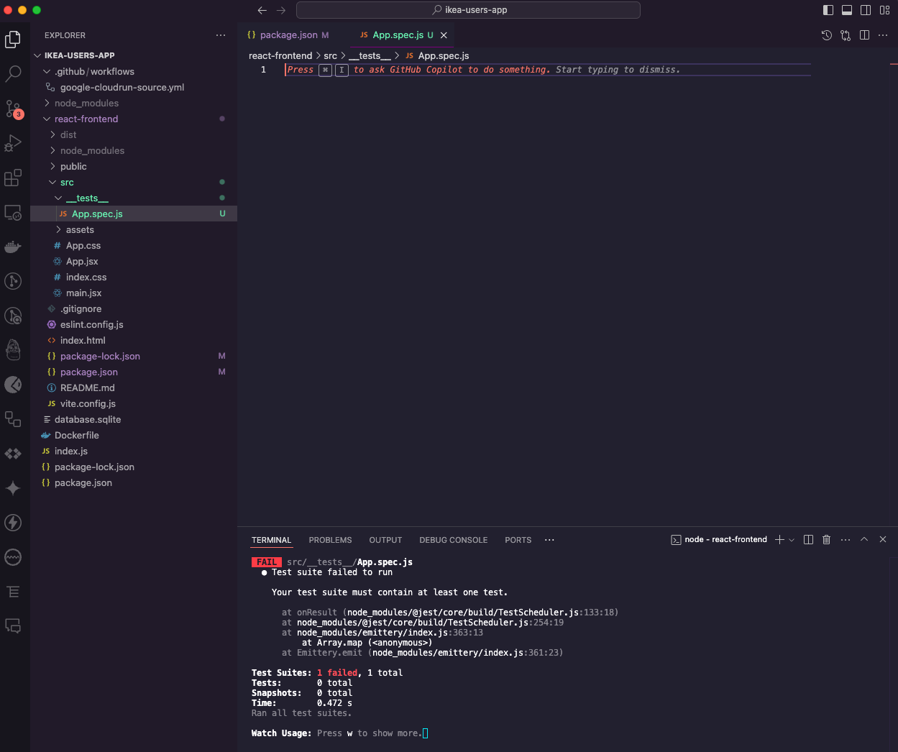
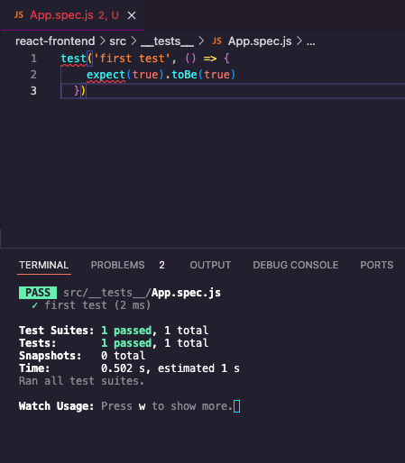

## Add Jest to App

1. Make sure you're in your react app: `cd react-frontend`
1. `npm install jest @testing-library/react @types/jest --save-dev`
1. In `package.json`, add a `test` script.

    ```js
    "scripts": {
        "dev": "vite",
        "build": "vite build",
        "lint": "eslint .",
        "preview": "vite preview",
        "test": "jest --watchAll"
    },
    ```

1. In the Terminal, run `npm run test`

    

<br>

## Add Test Directory

1. In the `src` directory, create a `__tests__` folder.
1. In your `__tests__` folder, create an `App.spec.js` file.

    

<br>

## First Test

1. Add a test to your `App.spec.js` file. __We'll address the linter next.__

    ```js
    test('first test', () => {
        expect(true).toBe(true)
    })
    ```
    
