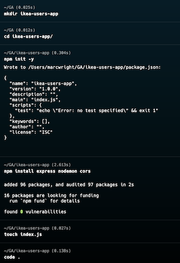
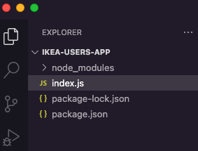
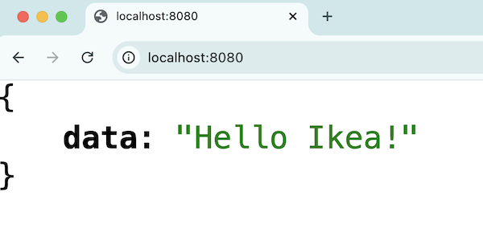
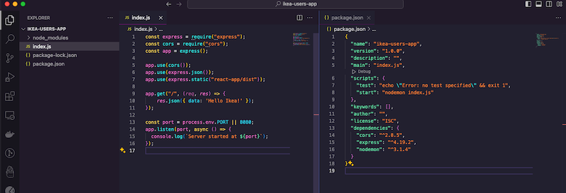
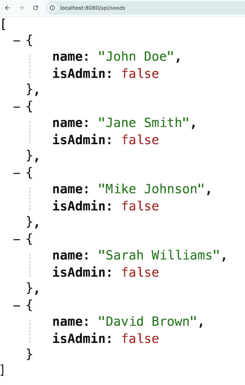
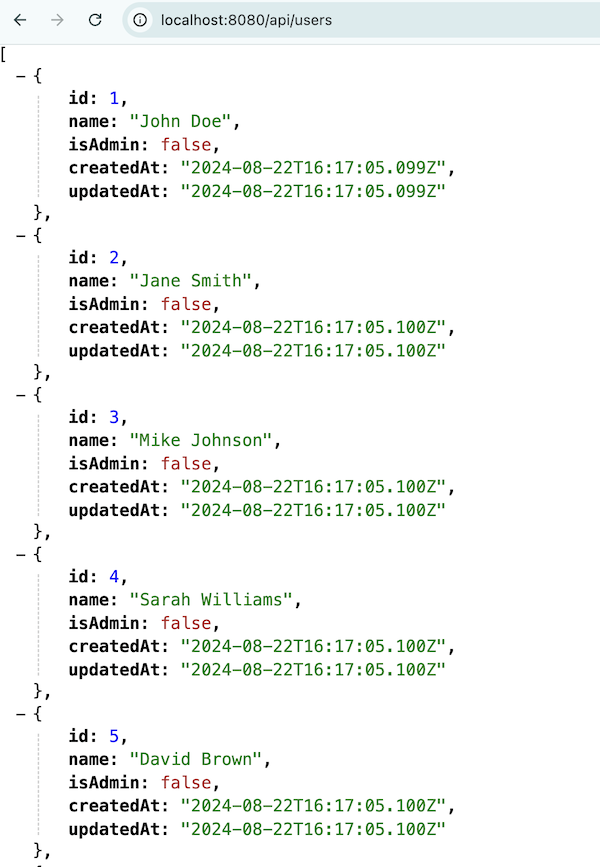
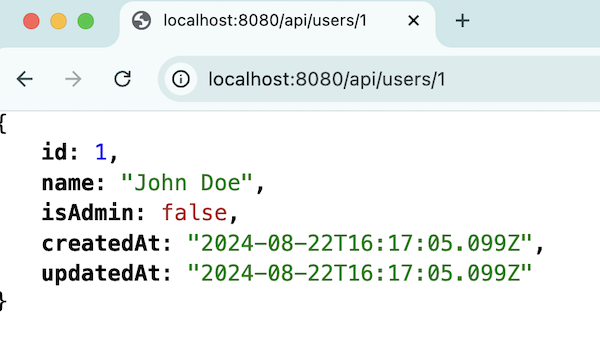

# CREATE EXPRESS APP server side

## Objectives

- Build a Node Express API
- Create CRUD endpoints for a User resource
- The app will also serve up the React App

<br>

## Getting Started - Initialize Express App

Let's build our own Node/Express API and test it out with Postman. We will use a SQLite datastore and use a package called [Sequelize](https://sequelize.org/) to connect to the database.

There is a Postman collection in this folder that contains the endpoints we'll build: `ikea-app-and-gcp-deploy-content/IKEA-Express-Users-App.postman_collection.json`

1. In your VM, open your Terminal and create a new folder in your users directory: `mkdir ikea-users-app`
1. Change into that directory: `cd ikea-users-app`
1. Open the directory in VS Code: `code .`
1. Run `npm init -y`.
   - This will create a `package.json` file to initialize our node application.
     > `package.json` is a JSON file that lives in the root directory of your project. Your `package.json` holds important information about the project. It contains human-readable metadata about the project (like the project name and description) as well as functional metadata like the package version number and a list of dependencies required by the application.
1. This will install a few node packages for us: `npm install express nodemon cors sequelize sqlite3`
    - `express` -[Express](https://expressjs.com/) is a minimal and flexible Node.js web application framework that provides a robust set of features for web and mobile applications.
    - `nodemon` - [This will automatically restart](https://www.npmjs.com/package/nodemon) the node application when file changes in the directory are detected.
    - `cors` - (helps with potential [cross-origin resource sharing issues](https://www.telerik.com/blogsall-you-need-to-know-cors-errors#:~:text=CORS%20errors%20happen%20when%20a,by%20the%20server's%20CORS%20configuration.))
    - [Sequelize](https://sequelize.org/) will convert Javascript methods to raw SQL in order to connect to the database.
    - `sqlite3` - [This package](https://www.sqlite.org/) is a light-weight database file that is great for development.

3. `touch index.js` - Running this command will create a file to serve as the entrypoint of our app.

    

    Your folder structure should look like so:

    

<br>

## Create a `.gitignore` file

1. `touch .gitignore`
2. It's not a good practice to check in node_modules folder since each developer can download their own version of the modules locally. Add this to the file: 

    ```yml
    node_modules
    core.*
    ```

    NOTE - if you accidentially check the core files into version control, you can run these commands to remove them.

    ```bash
    pip install git-filter-repo
    git filter-repo --path-glob 'core.*' --invert-paths --force
    ```

<br>

## Add code to `index.js`

1. Open the `index.js` file in your editor and add the following content. This creates a basic server and a single route.

    ```js
    // imports the express npm module
    const express = require("express");
    // imports the cors npm module
    const cors = require("cors");
    // Creates a new instance of express for our app
    const app = express();

    // .use is middleware - something that occurs between the request and response cycle.
    app.use(cors());
     // We will be using JSON objects to communcate with our backend, no HTML pages.
    app.use(express.json());
    // This will serve the React build when we deploy our app
    app.use(express.static("react-frontend/dist"));

    // This route will return 'Hello Ikea!' when you go to localhost:8080/ in the browser
    app.get("/", (req, res) => {
        res.json({ data: 'Hello Ikea!' });
    });

    // This tells the express application to listen for requests on port 8080
    const port = process.env.PORT || 8080;
    app.listen(port, async () => {
        console.log(`Server started at ${port}`);
    });
    ```

5. Add a `start` command to `package.json`. We'll use `nodemon` to serve our app. This way we don't have to stop and restart the server each time we make a change to our code.

    ```js
    "scripts": {
        "test": "echo \"Error: no test specified\" && exit 1",
        "start": "nodemon index.js" // ADD THIS
    }, 
    ```

1. Run `npm run start` from the Terminal and go to `http://localhost:8080/` in the browser.

    

    Completed code so far.

    


<br>

## Set-up our Database

1. At the top of `index.js` add these imports:

    ```js
    const { Sequelize, Model, DataTypes } = require('sequelize');
    ```

1. Next, initialize a new Sequelize instance.

    ```js
    // Create Sequelize instance
    const sequelize = new Sequelize({
        dialect: 'sqlite',
        storage: './database.sqlite'
    });
    ```
1. Create a User model.

    ```js
    // Define User model
    class User extends Model {}
    User.init({
        name: DataTypes.STRING,
        isAdmin: DataTypes.BOOLEAN,
    }, { sequelize, modelName: 'user' });
    
    // Sync models with database
    sequelize.sync();
    ```

1. Hardcode a `users` array with `name` and `isAdmin` properties. You can also use the [vscode-faker](https://marketplace.visualstudio.com/items?itemName=deerawan.vscode-faker) extention.

    ```js
    const users = [
        { name: "John Doe",  isAdmin: false },
        { name: "Jane Smith", isAdmin: false },
        { name: "Mike Johnson", isAdmin: false  },
        { name: "Sarah Williams", isAdmin: false  },
        { name: "David Brown", isAdmin: false  }
    ];
    ```
    
**Note - Feel free to add some more users or add/change your fields. However, if you do add/change your fields then make sure they align with the fields defined in the `User.init` step above ^^. Try deleting your `database.sqlite` file if you encounter any issues.**

1. Create an `/api/seeds` endpoint so that we can quickly populate our database with some users.

    ```js
    app.get('/api/seeds', async (req, res) => {
        users.forEach(u => User.create(u));
        res.json(users);
    });
    ```
1. Run `npm run start` to start your app, then go to `http://localhost:8080/api/seeds` in the browser.

    

<details>
<summary>Completed index.js file.</summary>

```js
const express = require("express");
const cors = require("cors");
const app = express();
const { Sequelize, Model, DataTypes } = require('sequelize');

// Create Sequelize instance
const sequelize = new Sequelize({
    dialect: 'sqlite',
    storage: './database.sqlite'
});

// Define User model
class User extends Model {}
User.init({
    name: DataTypes.STRING,
    isAdmin: DataTypes.BOOLEAN,
}, { sequelize, modelName: 'user' });

// Sync models with database
sequelize.sync();

const users = [
    { name: "John Doe",  isAdmin: false },
    { name: "Jane Smith", isAdmin: false },
    { name: "Mike Johnson", isAdmin: false  },
    { name: "Sarah Williams", isAdmin: false  },
    { name: "David Brown", isAdmin: false  }
  ];

app.use(cors());
app.use(express.json());
app.use(express.static("react-frontend/dist"));

app.get("/", (req, res) => {
    res.json({ data: 'Hello Ikea!' });
});

app.get('/api/seeds', async (req, res) => {
    users.forEach(u => User.create(u));
    res.json(users);
  });

const port = process.env.PORT || 8080;
app.listen(port, async () => {
  console.log(`Server started at ${port}`);
});
```
</details>

<br>


## `GET` `/api/users`

1. Create a `GET` route. _Take a minute to consider what this code is doing._

    ```js
    app.get('/api/users', async (req, res) => {
        const users = await User.findAll();
        res.json(users);
    });
    ```
1. Go to `http://localhost:8080/api/users` in the browser.

    


<br>

## `GET` `/api/users/:id`

1. Create a `GET` route to return a single user. _Take a minute to consider what this code is doing._

    ```js
    app.get("/api/users/:id", async (req, res) => {
        const user = await User.findByPk(req.params.id);
        res.json(user);
    });
    ```
1. Go to `http://localhost:8080/api/users/1` in the browser.

    


<br>


## `POST` `/api/users`

1. Create a `POST` route. _We'll test this out in Postman later._

    ```js
    app.post('/api/users', async (req, res) => {
        const user = await User.create(req.body);
        res.json(user);
    });
    ```
<br>

## `PUT` `/api/users/:id`

1. Create a `PUT` route. _We'll test this out in Postman later._

    ```js
    app.put("/api/users/:id", async (req, res) => {
        const { name, isAdmin } = req.body;

        const user = await User.findByPk(req.params.id);
        await user.update({ name, isAdmin });
        await user.save();
        res.json(user);
    });
    ```
<br>

## `DELETE` `/api/users/:id`

1. Create a `DELETE` route. _We'll test this out in Postman later._

    ```js
    app.delete('/api/users/:id', async (req, res) => {
        const user = await User.findByPk(req.params.id);
        await user.destroy();
        res.json({data: `The user with id of ${req.params.id} is removed.`});
    });
    ```
<br>

<details>
<summary>Completed index.js file</summary>

```js
const express = require("express");
const cors = require("cors");
const app = express();
const { Sequelize, Model, DataTypes } = require("sequelize");

// Create Sequelize instance
const sequelize = new Sequelize({
  dialect: "sqlite",
  storage: "./database.sqlite",
});

// Define User model
class User extends Model {}
User.init(
  {
    name: DataTypes.STRING,
    isAdmin: DataTypes.BOOLEAN,
  },
  { sequelize, modelName: "user" }
);

// Sync models with database
sequelize.sync();

const users = [
  { name: "John Doe", isAdmin: false },
  { name: "Jane Smith", isAdmin: false },
  { name: "Mike Johnson", isAdmin: false },
  { name: "Sarah Williams", isAdmin: false },
  { name: "David Brown", isAdmin: false },
];

app.use(cors());
app.use(express.json());
app.use(express.static("react-frontend/dist"));

app.get("/", (req, res) => {
  res.json({ data: "Hello Ikea!" });
});

app.get("/api/seeds", async (req, res) => {
  users.forEach((u) => User.create(u));
  res.json(users);
});

app.get("/api/users", async (req, res) => {
  const users = await User.findAll();
  res.json(users);
});

app.get("/api/users/:id", async (req, res) => {
  const user = await User.findByPk(req.params.id);
  res.json(user);
});

app.post("/api/users", async (req, res) => {
  const user = await User.create(req.body);
  res.json(user);
});

app.put("/api/users/:id", async (req, res) => {
    const { name, isAdmin } = req.body;

    const user = await User.findByPk(req.params.id);
    await user.update({ name, isAdmin });
    await user.save();
    res.json(user);
});

app.delete('/api/users/:id', async (req, res) => {
    const user = await User.findByPk(req.params.id);
    await user.destroy();
    res.json({data: `The user with id of ${req.params.id} is removed.`});
});

const port = process.env.PORT || 8080;
app.listen(port, async () => {
  console.log(`Server started at ${port}`);
});
```
</details>

<br>

## Additional Resources

- [Cross-origin Resource Sharing](https://developer.mozilla.org/en-US/docs/Web/HTTP/CORS)
- [What is package.json](https://heynode.com/tutorial/what-packagejson/)
