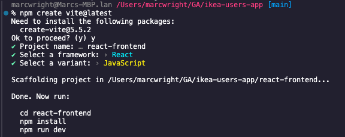
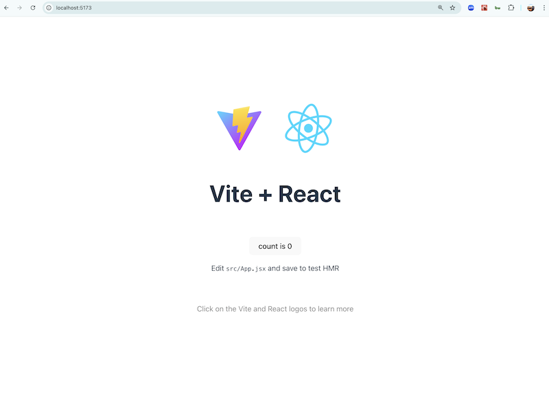
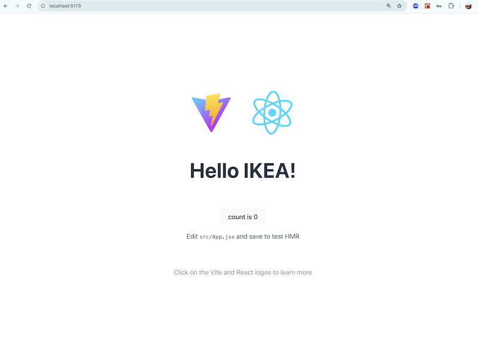
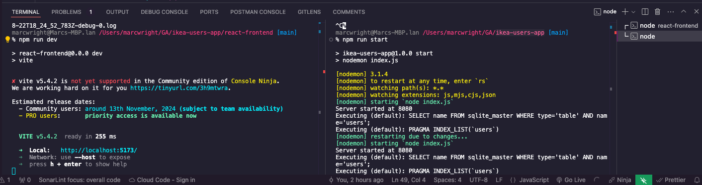

## CREATE REACT VITE APP

## Objectives

- Add a React app inside the Express App

<br>

## Create React Vite App

1. `cd ikea-users-app`
1. `npm create vite@latest`
1. Choose these options at the prompt and run the suggested commands afterwards.

    

1. in your browser, goto port <http://localhost:5173/>

    

6. Make a change to `src/App.tsx` and the app will rebuild (line 19).

    ```html
        <h1>Hello IKEA!</h1>
    ```

    

<br>

## Express App serving the React App

1. From the Terminal (inside your `react-frontend` directory) `npm run build`. This will create a dist directory to deploy and for your express app to serve.

1. In another Terminal tab, `cd` into the `ikea-users-app` parent folder. Run `npm run start` and go to <http://localhost:8080/>. You'll see the React app served from express now. _Note - for local development we'll still use the react server. The dist folder will not reflect our code changes unless we reun another build._

<br>

## Open 2 Terminal Tabs

1. You'll want to have 2 Terminal tabs open going forward.
    - Tab #1 React Frontend - make sure you're in the `react-frontend` folder and run `npm run dev`.
    - Tab #2 Express Backend - make sure your in the `ikea-users-app` folder and run `npm run start`.

    

<br>

## Render users in the UI

```js
import { useEffect, useState } from "react";
import "./App.css";

function App() {
  const [users, setUsers] = useState([]);
  const hostUrl = import.meta.env.PROD
    ? window.location.href
    : "http://localhost:8080/";

  const fetchUsers = async () => {
    const response = await fetch(`${hostUrl}api/users`);
    const usersToJson = await response.json();
    console.log(usersToJson)
    setUsers(usersToJson);
  };
  useEffect(() => {
    fetchUsers();
  }, []);

  return (
    <>
      <h1>Users</h1>
      <table>
        <thead>
          <tr>
            <th>Name</th>
            <th>Is Admin</th>
          </tr>
        </thead>
        <tbody>
          {users.map((user) => (
            <tr key={user.id}>
              <td>{user.name}</td>
              <td>{user.isAdmin.toString()}</td>
            </tr>
          ))}
        </tbody>
      </table>
    </>
  );
}

export default App;
```

<!-- <br>

## Refactor `isAdmin` into checkbox -->

<br>

## Create New User

1. Define a `createUser` function.

    ```js
    const createUser = async (e) => {
        e.preventDefault()
        const response = await fetch(`${hostUrl}api/users`, {
        method: "POST",
        headers: {
            "Content-type": "application/json",
        },
        body: JSON.stringify({ name: e.target.name.value, isAdmin: e.target.isAdmin.checked  }),
        });
        const newUser = await response.json();

        setUsers([...users, newUser]);
    }
    ```
1. Add a form.

    ```js
    <h1>New User</h1>
    <form onSubmit={createUser}>
        <label htmlFor="name">Name</label>
        <input type="text" name="name" id="name" />
        <label htmlFor="isAdmin">Is Admin</label>
        <input type="checkbox" name="isAdmin"/>
        <input type="submit" />
    </form>
    ```     

<br>


## Delete User

1. Define a `deleteUser` function.

    ```js
    const deleteUser = async (e) => {
        await fetch(`${hostUrl}api/users/${e.target.dataset.id}`, {
        method: "DELETE",
        headers: {
            "Content-type": "application/json",
        },
        });
        await fetchUsers();
    }
    ```

1. Add an `onClick` to the button.

    ```js
    <td>
        <button data-id={user.id} onClick={deleteUser}>Delete</button>
    </td>
    ```

<br>


## Update User

1. Add an `updateUser` function.

    ```js
    const updateUser = async (e) => {
        const response = await fetch(`${hostUrl}api/users/${e.target.dataset.id}`, {
        method: "PUT",
        headers: {
            "Content-type": "application/json",
        },
        body: JSON.stringify({ isAdmin: e.target.checked }),
        });
        await response.json();
        await fetchUsers();
    };
    ```

1. Add an `onChange` to the checkbox.

    ```js
    <td>
        <input
            data-id={user.id}
            type="checkbox"
            checked={user.isAdmin}
            onChange={updateUser}
        />
    </td>
    ```

<!-- <br>

## Bootstrap/Bootswatch -->

<br>

<details>
<summary>Finished App.jsx Code</summary>

```js
import { useEffect, useState } from "react";
import "./App.css";

function App() {
  const [users, setUsers] = useState([]);
  const hostUrl = import.meta.env.PROD
    ? window.location.href
    : "http://localhost:8080/";

  const fetchUsers = async () => {
    const response = await fetch(`${hostUrl}api/users`);
    const usersToJson = await response.json();
    console.log(usersToJson);
    setUsers(usersToJson);
  };
  useEffect(() => {
    fetchUsers();
  }, []);

  const updateUser = async (e) => {
    const response = await fetch(`${hostUrl}api/users/${e.target.dataset.id}`, {
      method: "PUT",
      headers: {
        "Content-type": "application/json",
      },
      body: JSON.stringify({ isAdmin: e.target.checked }),
    });
    await response.json();
    await fetchUsers();
  };

  const deleteUser = async (e) => {
    await fetch(`${hostUrl}api/users/${e.target.dataset.id}`, {
      method: "DELETE",
      headers: {
        "Content-type": "application/json",
      },
    });
    await fetchUsers();
  }

  const createUser = async (e) => {
    e.preventDefault()
    const response = await fetch(`${hostUrl}api/users`, {
      method: "POST",
      headers: {
        "Content-type": "application/json",
      },
      body: JSON.stringify({ name: e.target.name.value, isAdmin: e.target.isAdmin.checked  }),
    });
    const newUser = await response.json();

    setUsers([...users, newUser]);
  }
  

  return (
    <>
      <h1>New User</h1>
      <form onSubmit={createUser}>
        <label htmlFor="name">Name</label>
        <input type="text" name="name" id="name" />
        <label htmlFor="isAdmin">Is Admin</label>
        <input type="checkbox" name="isAdmin"/>
        <input type="submit" />
      </form>
      <br></br>
      <h1>Users</h1>
      <table>
        <thead>
          <tr>
            <th>Name</th>
            <th>Is Admin</th>
            <th>Delete</th>
          </tr>
        </thead>
        <tbody>
          {users.map((user) => (
            <tr key={user.id}>
              <td>
                <p>{user.name}</p>
              </td>
              <td>
                <input
                  data-id={user.id}
                  type="checkbox"
                  checked={user.isAdmin}
                  onChange={updateUser}
                />
              </td>
              <td>
                <button data-id={user.id} onClick={deleteUser}>Delete</button>
              </td>
            </tr>
          ))}
        </tbody>
      </table>
    </>
  );
}

export default App;

```

</details>
<br>

## Bonus

- Add [Bootstrap](https://getbootstrap.com/docs/5.3/getting-started/vite/) or [Material UI](https://mui.com/material-ui/)
