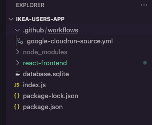

# Deploy to GCP with GitHub Actions

<br>

## Objectives

- Understand GitHub Actions
- Deploy an app to GCP via GitHub Actions

<br>

## Push to GitHub

1. Create a new repo in your public GitHub account and push your `ikea-users-app`. Login to your __public__ GitHub account and create a new repo. 

    

2.  Name the repo. Make sure it's public and that "Add a README file" is un-checked.

      

1. You can choose `https` (or `ssh` if you've installed your ssh keys) to tell your local repo where to push. Also, we should have our apps under version control, so we can use the bottom set of instructions.

    

<br>

## Configure GitHub Actions

1. In your GitHub repo, select the "Actions" tab. Search for "google" and "Deploy to Cloud Run from Source"

    

1. Click "Configure". GitHub will render a template.
1. Click "Commit Changes" and run `git pull origin main` to pull the files down locally. Open the `google-cloudrun-source.yml` file in VS Code.

    

1. Get these from your [GCP Project Dashboard](https://console.cloud.google.com/) and [Cloud Run](https://console.cloud.google.com/run):

    ```yaml
    name: 'Deploy to Cloud Run from Source'

    on:
      push:
        branches: ['main'] # TODO: maake this an array, use square brackets

    env:
      PROJECT_ID: 'student-001003' # TODO: update to your Google Cloud project ID
      REGION: 'europe-central2' # TODO: update to your region, WE MUST USE THIS REGION
      SERVICE: 'ikea-users-app' # TODO: update to your service name
      ```


    You can find your PROJECT_ID on your GCP dashboard or on Whizlabs

    

    

1. We'll need to make some tweaks to the `google-cloudrun-source.yml` file. Navigate down to the next section (__Completed `google-cloudrun-source.yml` file__) to copy and replace the contents of your `google-cloudrun-source.yml`. Then, come back to the next step to confiure with your GCP credentials.


1. In your GitHub actions file, change the 'Checkout' "uses" property. Then add the __Install Dependencies__ and __Build React App__ steps:

    ```yaml
     steps:
      - name: 'Checkout'
        uses: 'actions/checkout@692973e3d937129bcbf40652eb9f2f61becf3332' # actions/checkout@v4
      
      - name: Install Dependencies
        working-directory: ./react-frontend
        run: npm install
    
      - name: Build React App
        working-directory: ./react-frontend
        run: npm run build
    ```

    <!--  -->

1. In the yaml file, delete the ` # Configure Workload Identity Federation and generate an access token.` section.

1. In its place, add this option for authentication:

    ```yaml
      # NOTE: Alternative option - authentication via credentials json
      - name: Google Auth
        id: auth
        uses: 'google-github-actions/auth@v2'
        with:
          credentials_json: '${{ secrets.GCP_CREDENTIALS }}'
    ```

<br>

## Completed `google-cloudrun-source.yml` file

Make sure to change the appropriate TODOs with your GCP Credentials.

<details>
  <summary>COMPLETED google-cloudrun-source.yml FILE (ADD YOUR CREDENTIALS)</summary>

```yaml
# This workflow will deploy source code on Cloud Run when a commit is pushed to
# the "main" branch.
#
# To configure this workflow:
#
# 1. Enable the following Google Cloud APIs:
#
#    - Artifact Registry (artifactregistry.googleapis.com)
#    - Cloud Build (cloudbuild.googleapis.com)
#    - Cloud Run (run.googleapis.com)
#    - IAM Credentials API (iamcredentials.googleapis.com)
#
#    You can learn more about enabling APIs at
#    https://support.google.com/googleapi/answer/6158841.
#
# 2. Create and configure a Workload Identity Provider for GitHub:
#    https://github.com/google-github-actions/auth#preferred-direct-workload-identity-federation.
#
#    Depending on how you authenticate, you will need to grant an IAM principal
#    permissions on Google Cloud:
#
#    - Artifact Registry Administrator (roles/artifactregistry.admin)
#    - Cloud Run Source Developer (roles/run.sourceDeveloper)
#
#    You can learn more about setting IAM permissions at
#    https://cloud.google.com/iam/docs/manage-access-other-resources.
#
# 3. Change the values in the "env" block to match your values.

name: 'Deploy to Cloud Run from Source'

on:
  push:
    branches: ['main']

env:
  PROJECT_ID: 'student-001003' # TODO: update to your Google Cloud project ID
  REGION: 'europe-central2' # TODO: update to your region
  SERVICE: 'ikea-users-app' # TODO: update to your service name

jobs:
  deploy:
    runs-on: 'ubuntu-latest'

    permissions:
      contents: 'read'
      id-token: 'write'

    steps:
      - name: 'Checkout'
        uses: 'actions/checkout@692973e3d937129bcbf40652eb9f2f61becf3332' # actions/checkout@v4
      
      - name: Install Dependencies
        working-directory: ./react-frontend
        run: npm install
    
      - name: Build React App
        working-directory: ./react-frontend
        run: npm run build

      # NOTE: Alternative option - authentication via credentials json
      - name: Google Auth
        id: auth
        uses: 'google-github-actions/auth@v2'
        with:
          credentials_json: '${{ secrets.GCP_CREDENTIALS }}'
      

      - name: 'Deploy to Cloud Run'
        uses: 'google-github-actions/deploy-cloudrun@33553064113a37d688aa6937bacbdc481580be17' # google-github-actions/deploy-cloudrun@v2
        with:
          service: '${{ env.SERVICE }}'
          region: '${{ env.REGION }}'
          # NOTE: If using a different source folder, update the image name below:
          source: './'

      # If required, use the Cloud Run URL output in later steps
      - name: 'Show output'
        run: |-
          echo ${{ steps.deploy.outputs.url }}
```
</details>

<br>

## Add Variables to GitHub Secrets

1. Go to the GCP Console. Then `IAm & Admin` -> `Service Accounts`. Select "Manage Keys". __NOTE - I created keys for my student service account not compute as in the screenshot.__

    

1. Select "ADD KEY" and "Create new key".

   


1. Click "CREATE" and a JSON version of your key will be automatically downloaded.

    


1. Open the file in VS Code. 

1. Add the entire downloaded JSON file to GitHub.

1. In your GitHub repo, go to `Settings` -> `Secrets and variables` -> `Actions`. Click "New repository secret". The name of the secret is `GCP_CREDENTIALS`. Copy and paste the entire JSON file. Then "Add secret".

    

1. Repeat the previous step and add a secret named `GCP_PROJECT_ID`. It is the name of your `Project ID` from "Push to GitHub" step 5 above ^^. Then "Add secret".

    

<!-- 6. Change things to v2 -->

## Test that GitHub Actions work on a push to the `main` branch

1. Commit changes then git push
1. Make changes - add, commit and push and watch GH Actions.

    

    

<br>

## Where do we find the deployed URL?

You'll find it on the Cloud Run Dashboard. Click on the name of your service.


You'll find your URL below. However, if you navigate to the URL in the browser it'll be blocked. We need to allow public access permissions.


<br>

## Update Cloud Run Permissions (if needed)

[We'll follow the steps here to make the Cloud Run Service public.](https://cloud.google.com/run/docs/authenticating/public)

For an existing Cloud Run service

1. Go to the Google Cloud console.
1. Click the checkbox at the left of the service you want to make public. (Don't click the service itself.)
1. In the information pane in the top right corner click the Permissions tab. If the information pane isn't visible, you may need to click Show Info Panel, then click Permissions.
1. Click Add principal.

In the New principals field, enter the value allUsers

1. From the Role drop-down menu, select the Cloud Run Invoker role.
1. Click Save.
1. You will be prompted to verify that you would like to make this resource public. Click Allow public access to apply the change to the service IAM settings.

Congrats! You should now be able to access your app. You can also go to the `/api/users` endpoint and see your JSON user data.


<br>

## Additional Resources

- [Allow Public Access to Cloud Run](https://cloud.google.com/run/docs/authenticating/public)
