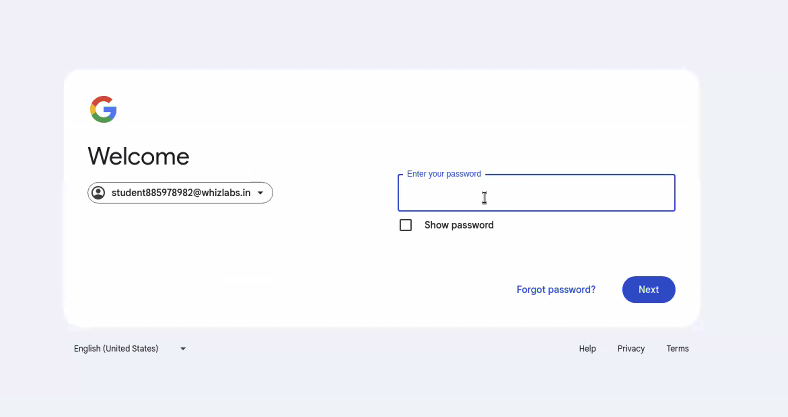

# DEPLOY TO GCP

 

## Objectives

- Deploy directly to GCP Cloud Run from the command line
- Understand the GCP CLI

 

## Login to GCP from WhizLabs for the first time

1. Login to your WhizLabs account and go to "Custom Sandboxes". Click on "Open Console".

    

1. Sign into your Google Cloud account using your WhizLab user Name and Password.

    

    

1. Allow GCP or the SDK to access whatever info it asks for on the next screen(s). That should get you to your Cloud console Dashboard. Go ahead and choose whatever Country you're in.

    

 

## Login to GCP from the Terminal

1. `gcloud auth login`. This will open up a browser tab. Choose your account -> Sign in to Google Cloud SDK -> Hot Allow on "Google Cloud wants to access your Google Account"
2. You should see a message "You are now authenticated with the gcloud CLI!"

    

 

## Build React App

1. `cd` into your `react-frontend` folder and run `npm run build`. This will create a `dist` folder. The express app will serve the build from the `dist` in production.

   
   
 

## Login to GCP

1. Make sure you're in the `ikea-users-app` folder for the following steps. If you were previously in the `react-frontend` folder, you can run  `cd ..` to go up one directory. You can run `pwd` (print working directory) in the Terminal to confirm you are in the `ikea-users-app` folder.

1. `gcloud auth login`. This will open up a browser tab. Choose your account -> Sign in to Google Cloud SDK -> Hot Allow on "Google Cloud wants to access your Google Account"
2. You should see a message "You are now authenticated with the gcloud CLI!"

1. `gcloud config set project PROJECT_ID`

    
  
   
   
1. You can also find your `Project ID` in your WhizLabs account under "Custom Sandboxes"

   

 

<!-- ## Log into GCP CLI

1. In the Terminal, let's log into to the Google Cloud CLI: `gcloud auth login`. This will open your browser to confirm, then ask you to return back to the Terminal. 

1. In the Terminal, run `gcloud config set project PROJECT_ID`. You can replace `PROJECT_ID` with the Project ID from your WhizLabs Custom Sandbox.
  
    

<!-- 1. Go to the [Google Cloud Console](https://console.cloud.google.com/)

2. Create a New Project

  

3. Using Cloud Run which is serverless, only billed when someone sends a request -->

 

## Deploy to GCP from CLI

1. `cd` into the parent directory called `ikea-users-app`.

1. Go to the Terminal and run: `gcloud beta run deploy --source . --region europe-central2`. _Note - make sure you're in the parent directory._  Select "yes" to any prompts.

1. When it asks for the service name, hit enter. We'll leave it balck and it'll create the name for us.

1. Select yes or y for all questions/prompts.

<!-- 1. Go to the Terminal and run: `gcloud run deploy`. _Note - make sure you're in the parent directory._  Select "yes" to any prompts. -->

<!--  -->

5. Deployment can take a few minutes. When deployed, the deployed URL be displayed.

6. Try out your Service URL in the Browser.

_Note: [follow these steps to grant public permissions if you don't have access.](https://cloud.google.com/run/docs/authenticating/public)_

 

## Additional Resources

- [Google Cloud Quick Start]( https://cloud.google.com/sdk/docs/quickstarts)
- [Stack Overflow - region constraints](https://stackoverflow.com/questions/71250283/gcloud-beta-run-deploy-source-throws-412)
