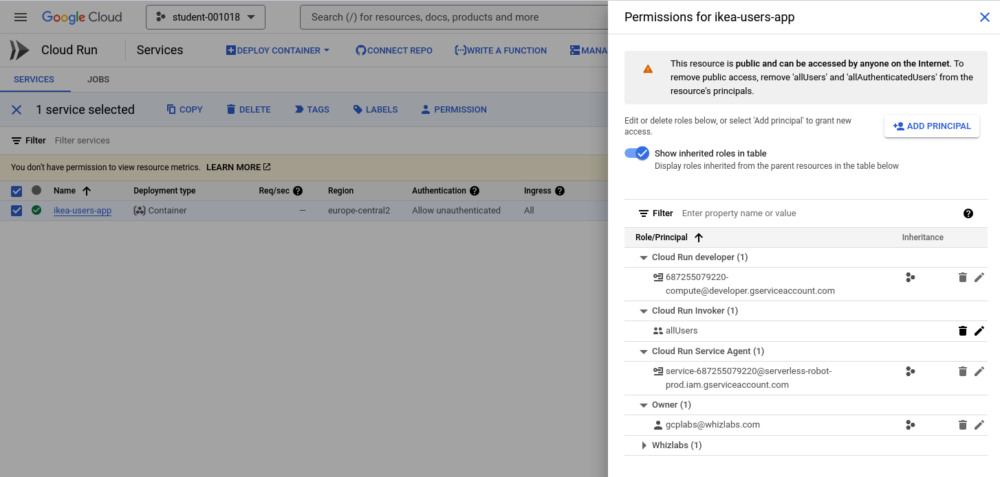
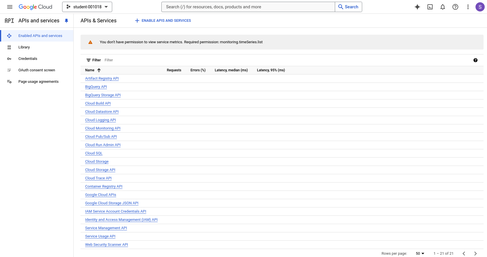
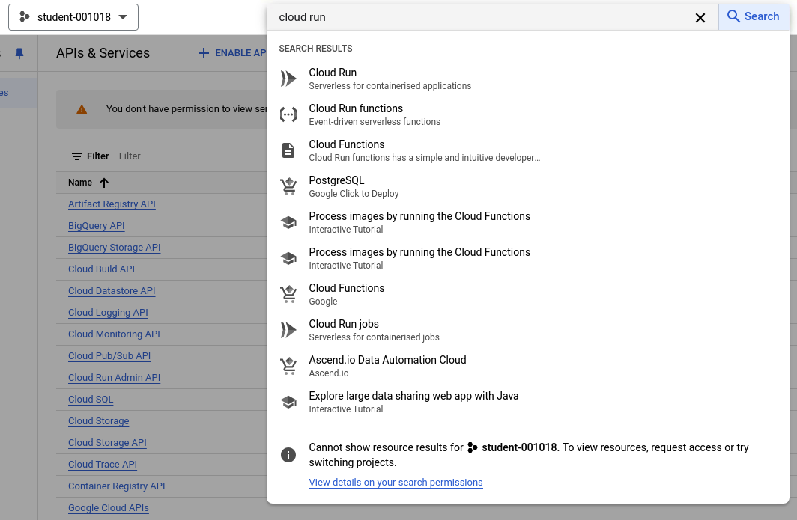
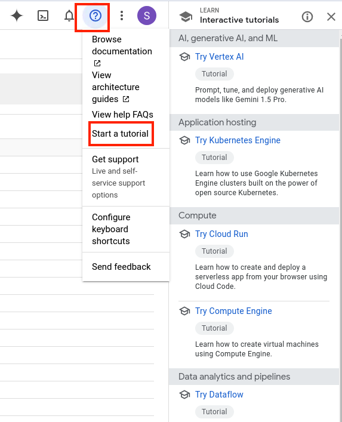
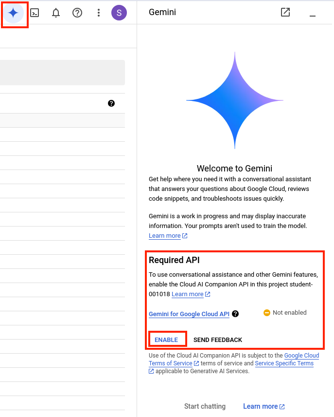
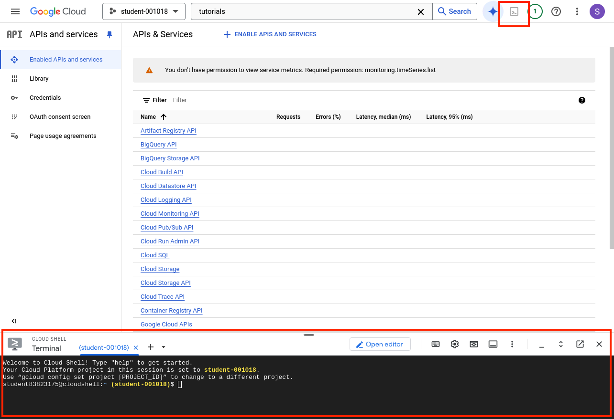
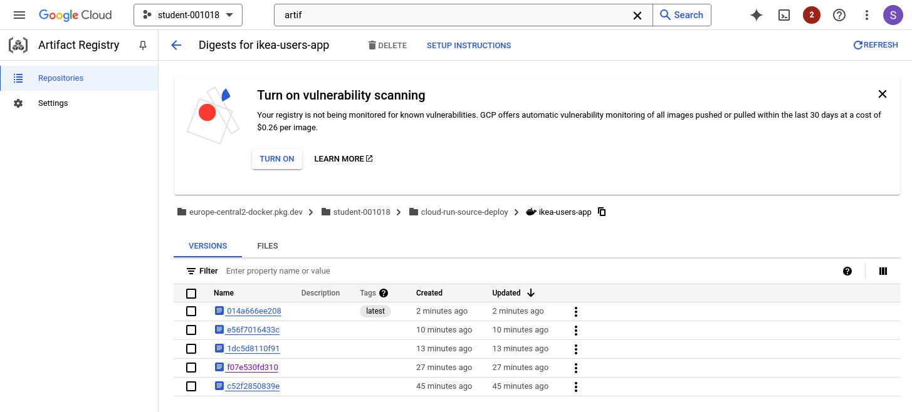
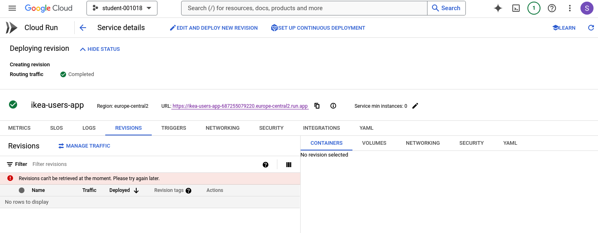

# GCP Walk Through

## Objectives

- Understand key IAM concepts in GCP
- Understand Revisions and Rollbacks

 

## Understand key IAM concepts in GCP

Basic Project Roles
- Owner: Can do anything on a project
- Editor: Can do everything but set permissions and billing for a project
- Viewer: You can see anything in a project but not edit

Types of entities

- Principal: represents an identity that can access a resource. Each principal has its own identifier. 
- Role: A role is a collection of permissions.
- Service Account: Service accounts are principals. This means that you can grant service accounts access to Google Cloud resources. A service account is a special Google account that belongs to your application or a virtual machine (VM) instead of an individual end user. Your application uses the service account to call the Google API of a service, so that the users aren't directly involved

    These are pretty broad roles. [Check out this doc on how to set more granular permissions](https://cloud.google.com/iam/docs/choose-predefined-roles?utm_source=youtube&utm_medium=unpaidsoc&utm_campaign=CDR_mao_security_xqclvtaecdg_WhatisIAM_110722&utm_content=description).

#### IAM lets you set allow policies at the following levels of the resource hierarchy:

__Organization level__. The organization resource represents your company. IAM roles granted at this level are inherited by all resources under the organization. For more information, see Access control for organizations using IAM.

__Folder level__. Folders can contain projects, other folders, or a combination of both. Roles granted at the highest folder level will be inherited by projects or other folders that are contained in that parent folder. For more information, see Access control for folders using IAM.

__Project level__. Projects represent a trust boundary within your company. Services within the same project have a default level of trust. For example, App Engine instances can access Cloud Storage buckets within the same project. IAM roles granted at the project level are inherited by resources within that project. For more information, see Access control for projects using IAM.

__Resource level__. In addition to the existing Cloud Storage and BigQuery ACL systems, additional resources such as Genomics Datasets, Pub/Sub topics, and Compute Engine instances support lower-level roles so that you can grant certain users permission to a single resource within a project.
 
[How to set up Organizations](https://cloud.google.com/iam/docs/resource-hierarchy-access-control#:~:text=Google%20Cloud%20resources%20are%20organized,levels%20of%20the%20resource%20hierarchy.)

To manage users at scale - if a person needs access to multiple folders, you can create a group and add various roles to the group.

Principal of least priviledge is very important here.

 

## IAM (Identity and Access Management)

A collection of tools that allows administrators to define who can do what on which resources in a Google Cloud project.

- For example, this lists the roles that are able to trigger a Cloud Run service.
- Cloud Run Invoker - this says that allUsers on the internet can trigger this url.
- The owner automatically gets permissions to trigger services.
- Unlike a Cloud Run service, which listens for and serves requests, a Cloud Run job only runs its tasks and exits when finished. A job does not listen for or serve requests.
- ADD PRINCIPAL: enter a co-worker's email and assign a role to them.

.

 

## APIs & Services

This is a quick glance at what services have been enabled.

 

## Search

The search box is the fastest way to find a resource

 

## Tutorials

Google Cloud provides many 10 min tutorials on almost any topic. You can use the Cloud Shell for practice.

 

## Gemini

[Gemini for Google Cloud](https://cloud.google.com/blog/products/ai-machine-learning/gemini-for-google-cloud-is-here) is a new generation of AI assistants for developers, services, and applications that help you work more effectively.

 

## Cloud Shell

[Cloud Shell](https://cloud.google.com/shell) is a free online environment, with command-line access for managing your infrastructure and an online code editor for cloud development.

 

## Cloud Artifact Registry

[Artifact Registry](https://cloud.google.com/artifact-registry/docs/overview) is a single place for your organization to manage container images and language packages (such as Maven and npm).

## Understand Revisions and Rollbacks

Cloud Run allows you to configure traffic for testing or to roll back to a previous artifact.

 

## Additional Resources

- [What is Cloud IAM?](https://www.youtube.com/watch?v=xQClVtAECdg)
- [Cloud Run Documentation](https://cloud.google.com/run/docs/create-jobs#:~:text=Unlike%20a%20Cloud%20Run%20service,listen%20for%20or%20serve%20requests.)
- [Resource Hierarchy](https://cloud.google.com/iam/docs/resource-hierarchy-access-control#:~:text=Google%20Cloud%20resources%20are%20organized,levels%20of%20the%20resource%20hierarchy)
