# Testing with Postman


## Objectives

- Test the CRUD endpoints of our `ikea-users-app`

<br>

## Set-up Environment

1. Open Postman, click "New" and "Environment"
1. Name it `ikea-dev`
1. Add a variable named `baseUrl` with a value of `localhost:8080`

    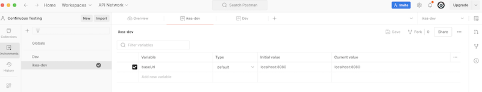

<br>

## Set-up Collection

1. Open Postman, click "New" and "Collection"
1. Name it `IKEA-Express-Users-App`

    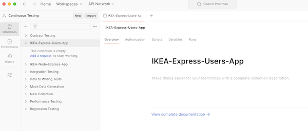

<br>

## `GET` `/api/users`

1. Click the 3 horizontal bubbles to "Add a Request".
1. You can start typing curly brackets to see the `baseUrl` variable.
1. The endpoint is `/api/users`

    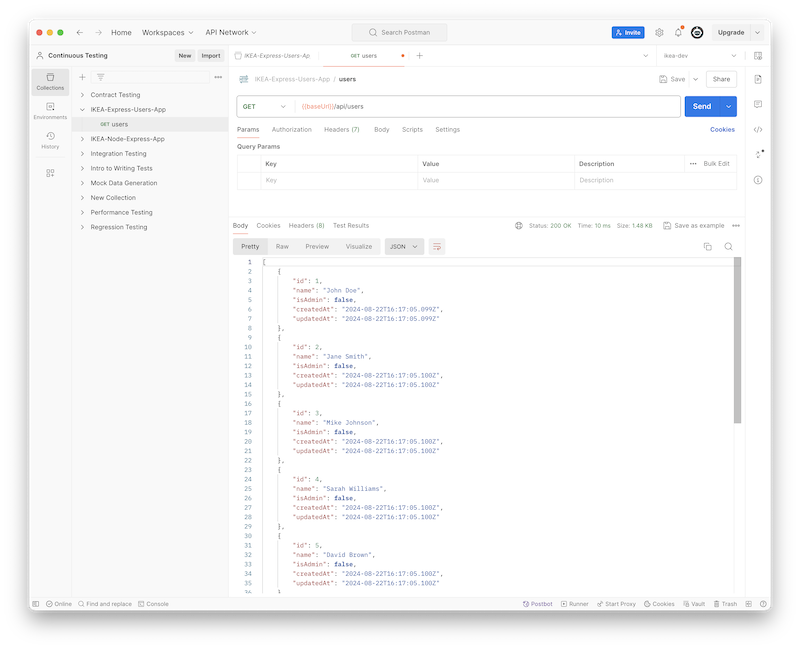

<br>

## `GET` `/api/users/:id`

1. Click the 3 horizontal bubbles to "Add a Request".
1. You can start typing curly brackets to see the `baseUrl` variable.
1. The endpoint is `/api/users/1`

    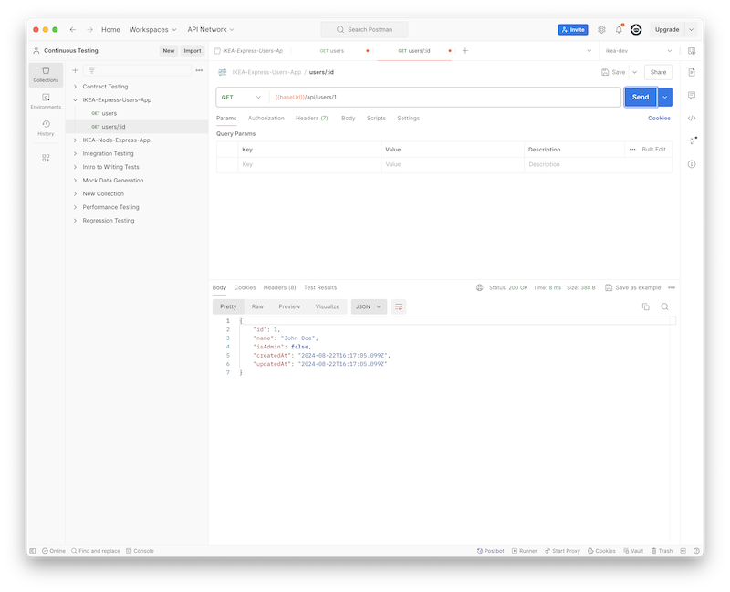

<br>

## `POST` `/api/users`

1. Click the 3 horizontal bubbles to "Add a Request".
1. You can start typing curly brackets to see the `baseUrl` variable.
1. The endpoint is `/api/users/:id` with a `POST` verb.
1. In the `body` tab, add info for a new user. _Make sure to select `raw` and `JSON` for the format._

    ```js
    {
        "name": "Charlie Day",
        "isAdmin": false 
    }
    ```
    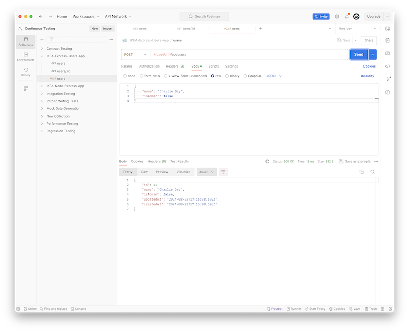

<br>

## `PUT` `/api/users/:id`

1. Click the 3 horizontal bubbles to "Add a Request".
1. You can start typing curly brackets to see the `baseUrl` variable.
1. The endpoint is `/api/users/:id` with a `PUT` verb.
1. In the `body` tab, add info for a new user. _Make sure to select `raw` and `JSON` for the format._
1. You can send any field(s) you want to update.

    ```js
    {
        "isAdmin": true
    }
    ```


    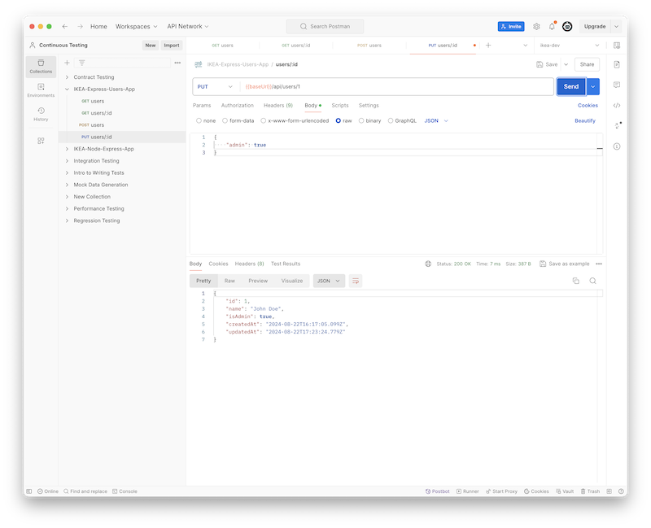

<br>


## `DELETE` `/api/users/:id`

1. Click the 3 horizontal bubbles to "Add a Request".
1. You can start typing curly brackets to see the `baseUrl` variable.
1. The endpoint is `/api/users/:id` with a `DELETE` verb.

    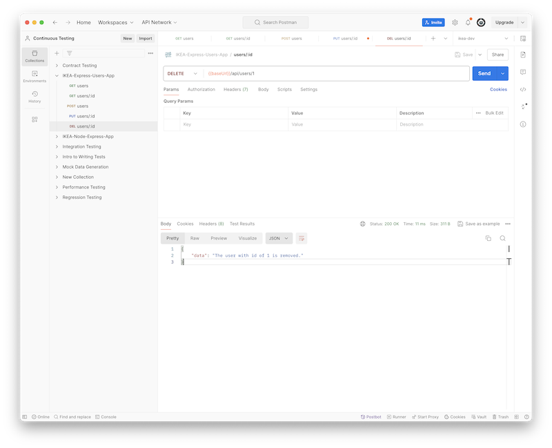


<br>

## Generate Tests with Postman Snippets

1. Choose one of your requests.
1. Select the "Tests" tab.
1. Use the snippets on the right.
1. Click "Send" to run thet tests.
1. Seletc the "Test Results" tab to see the results.

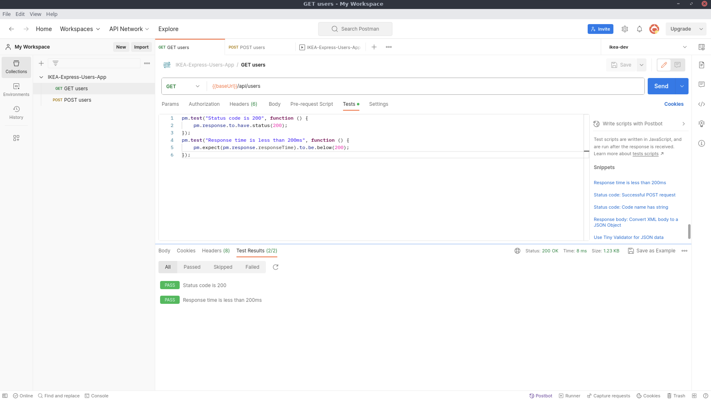

<br>

## Auto run Tests

1. Before we run the tests, make sure that your requests are accessing a valid user and _not the one you just deleted_.
1. Click the 3 horizontal bubbles to "Run Collection".

    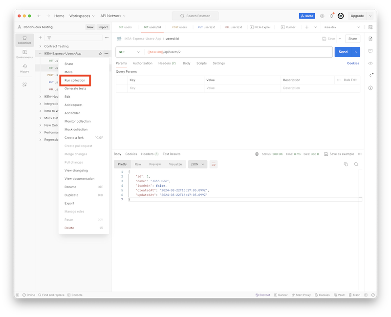

1. Run the Collection

    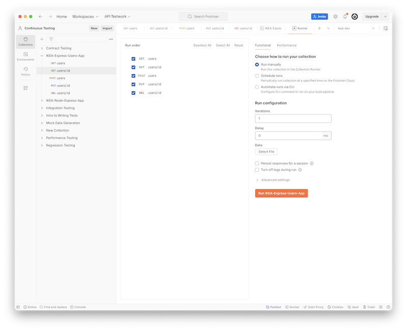


## POST Test Example

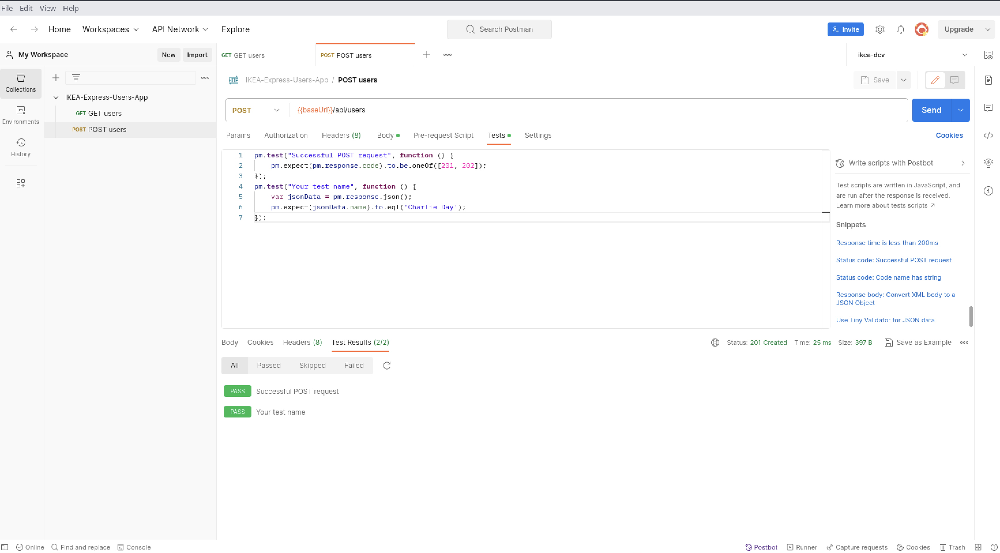
<!-- ## Auto Generate tests

1. Change the Delete route.

    ```js
    app.delete('/api/users/:id', async (req, res) => {
        const user = await User.findByPk(req.params.id);
        await user.destroy();
        res.send(`The user is removed.`).status(204)
    });
    ```

1. Click the 3 horizontal buttons for "Generate tests" on the Collection or the "Test Results" Tab.

    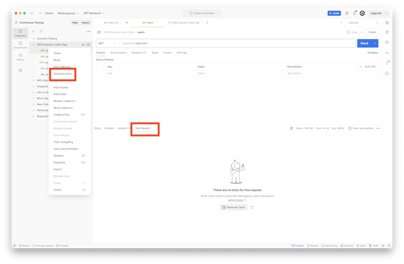 -->

<br>

## Postman Mocks

You can mock data fields with this syntax `{{$}}`.

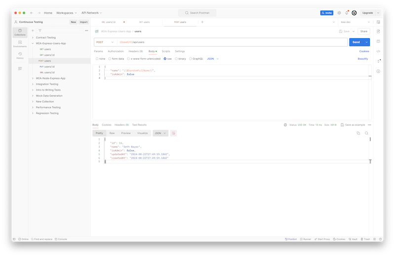

<br>

## Additional Resources

- [Postman Test Script Examples](https://learning.postman.com/docs/tests-and-scripts/write-scripts/test-examples/)
