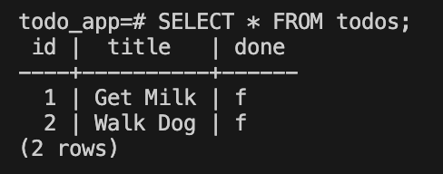
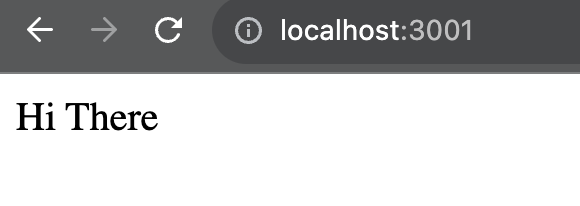

# Dockerize the Todo App

<br>

__Note: we need to use the `sudo` command in the VM for elevated permisssions. You can also run these commands in the Terminal to skip using `sudo` each time.__

```
sudo groupadd docker
sudo gpasswd -a $USER docker
newgrp docker
```

<br>

## Clone Locally to your VM

1. In your Terminal, run `cd ~` to get to your Home directory.
1. Then run `git clone https://git.generalassemb.ly/ModernEngineering/ikea-dockerize-to-do-app.git`. This will ask you for your GA Github Enterprise Username and Password.
1. Or, if you've configured your [SSH Keys](https://git.generalassemb.ly/ModernEngineering/ikea-class-schedule/blob/main/github-ssh-setup.md), you can run `git clone git@git.generalassemb.ly:ModernEngineering/ikea-dockerize-to-do-app.git`.
1. Run `code ikea-dockerize-to-do-app` to open the app in VS Code.

<br>

1. Make sure Docker is running and Postgres is turned off. We want to stop the VM version of Postgresql since Docker will also want to use the default port (TCP/5432). To stop postgres in the VM run: 

    ```sh
    sudo service postgresql stop
    ```

2. Stop all running instances of node:

   ```sh
   sudo kill -9 $(sudo lsof -t -i:8080)
   sudo kill -9 $(sudo lsof -t -i:5173)
   ```

    - `8080` is the default node backend
    - `5173` is the default react frontend
    - This command works for any port you need to kill.
    - If you get a `not enough arguments message` it likely means you do not have any instances of node running.

<br>

## Create the Container network

We'll need to create a container network for your containers to talk to each other. Containers in the same container network can resolve each others' host names by their container name.

`sudo docker network create todo-app`

This command creates a new network in Docker named `todo-app`. This network allows containers that are attached to it to communicate with each other using their container names as hostnames. Docker networks provide isolation between different sets of containers and organize them into logical groups.


<br>


## Dockerfile the Postgres Database

1. Note that inside the `starter_todo_app`, we've renamed the node express todo app folder `backend`.

2. Inside the `starter_todo_app/backend/db` folder create a `Dockerfile` (from inside the `backend/db` folder): `touch Dockerfile`

    ```dockerfile
    FROM postgres
    # Starting point of your Docker image.
    # By using postgres, we are starting with an environment that has PostgreSQL already installed and configured.
    # This simplifies your Dockerfile since you don't have to install PostgreSQL from scratch

    ENV POSTGRES_PASSWORD docker
    # This is the password we'll define for the Docker Postgres instance
    # Confirm the pool object in index.js has "docker" as the password.

    ENV POSTGRES_DB todo_app_db
    # This is what we'll name the database inside the container

    COPY todo.sql /docker-entrypoint-initdb.d/
    # docker-entrypoint-initdb.d/ is a special directory used by the PostgreSQL Docker image
    # Copying the todo.sql file to the listed path in the container
    # This will create the todos table and add some todos
    ```


3. To build the image (if you're in the `backend/db` directory): `sudo docker build . -t db`. *Make sure you are running this build command from inside the `starter_todo_app/backend/db` folder.* This command tells Docker to create a new image based on the instructions provided in the Dockerfile. 
    - `-t db`: This flag tags the image with the name `db`. The -t stands for "tag," which allows you to name the image for easier reference later.

4. To run the image in a container: `sudo docker run -d --name db-container -p 5432:5432 --network todo-app db`
    - `docker run` = docker create + docker start
    - `-d` runs the container in the background, so the terminal is free for other commands
    - `--name db-container` names the container `db-container`
    - `-p 5432:5432` maps port 5432 on the host to port 5432 in the container. `<host_port>:<container_port>`
    - `--network todo-app` connects the container to the `todo-app` Docker network
    - `db` specifies the image to use for the container
   
5. To confirm that we created the table and added some todos:

    - `sudo docker exec -it db-container psql todo_app_db -U postgres`
        - This will get us into the container and enter the `psql` shell.
        - -it flag opens an interactive terminal session inside the db-container
    - `SELECT * FROM todos;`
        - Get all the todos

    

<br>

## Dockerfile for Node Express Backend

1. Open a new Terminal tab for the `backend` steps.
1. Note that inside the `starter_todo_app`, we've renamed the node express todo app folder `backend`.
1. Create a `Dockerfile` in the `starter_todo_app/backend` folder (*how do we create new file from the command line?*):

    ```dockerfile
    FROM node:alpine
    # This is the image we'll use as the base
    # base image will use Node.js runtime based on Alpine Linux Distribution
    # Alpine is a minimal, lightweight Docker image optimized for running applications in containers

    WORKDIR /usr/src/app
    # Create app directory
    # WORKDIR sets the working directory inside the container where the following instructions will be executed

    COPY . .
    # Copy the app files/directories from local filesystem to the Docker container

    RUN npm install
    # Install dependencies

    EXPOSE 3001
    # The port we want the container to open (i.e. run on)

    CMD [ "npm", "run", "start" ]
    # The command to start the server inside the container
    ```

1. Add a `.dockerignore` file for files and folders we don't want to copy into the container:

    ```text
    node_modules
    npm-debug.log
    db
    core.*
    ```

1. To build the image: `sudo docker build . -t backend`. *Make sure you are running this build command from inside the `starter_todo_app/backend` folder.*

    - The `-t` flag lets us tag the image so it's easier to find.

1. To run the image in a container: `sudo docker run -d --name backend-container -p 3001:3001 --network todo-app backend`

    - The `-p` flag defines the local port and the container port. These can be different.
    - The `--name` flag lets us name the container
    - `backend` is the name of the image
    - To view the server logs remove the `-d` flag (quiet mode) after `docker run`

1. You can run `sudo docker ps` to check out the list of running containers.

1. Go to `localhost:3001` in the browser. We should see the same "Hi There" message as if running the app locally.

    

<br>

## Dockerfile for the React frontend

1. Open a new Terminal tab for the `frontend` steps.
1. We've renamed the React todo app folder `frontend`.
2. Create a `Dockerfile` (*how do we create new file from the command line?*):

    ```dockerfile
    FROM node:alpine
    # This is the image we'll use as the base

    WORKDIR /usr/src/app
    # Create app directory

    COPY . .
    # Copy the app to the directory

    RUN npm install
    # Install dependencies

    EXPOSE 3000
    # The port we want the container to open (i.e. run on)

    CMD [ "npm", "run", "start" ]
    # The command to start the server inside the container
    ```

3. Add a `.dockerignore` file for files and folders we don't want to copy into the container:

    ```text
    node_modules
    npm-debug.log
    db
    core.*
    ```

4. To build the image: `sudo docker build . -t frontend`. *Make sure you are running this build command from inside the `starter_todo_app/frontend` folder.*

    - The `-t` flag lets us tag the image so it's easier to find.

5. To run the image in a container: `sudo docker run -d --name frontend-container -p 3000:3000 --network todo-app frontend`

    - The `-p` flag defines the local port and the container port. These can be different.
    - The `--name` flag lets us name the container
    - `frontend` is the name of the image
    - To view the server logs remove the `-d` flag after `docker run`

6. Go to `localhost:3000` in the browser. THen open your Dev Tools and navigate to the Console tab. You should see 2 todos in your `data` Array.

#### Congrats! You have created 3 decoupled Docker containers that can communicate with each other.

<br>

## Debugging: To stop and remove all containers

If you get a message saying that a container name is already taken, you may need to stop and remove a container or two.

1. Let's stop all running containers: `sudo docker stop $(sudo docker ps -a -q)`
2. `sudo docker ps -a` will show all stopped containers.
3. `sudo docker container prune` will remove all stopped containers.

    - If you're still having build issues it may help to remove all images: `sudo docker rmi $(sudo docker images -a -q)`

*If you get a message that post 5432 is in use, make sure to stop the local Postgres engine in your VM: `sudo service postgresql stop`*

<!-- <br> -->

<!-- ## YOU DO

Now that you have your containers orchestrated, try your Postman collection requests again.
# ikea-dockerize-to-do-app -->
